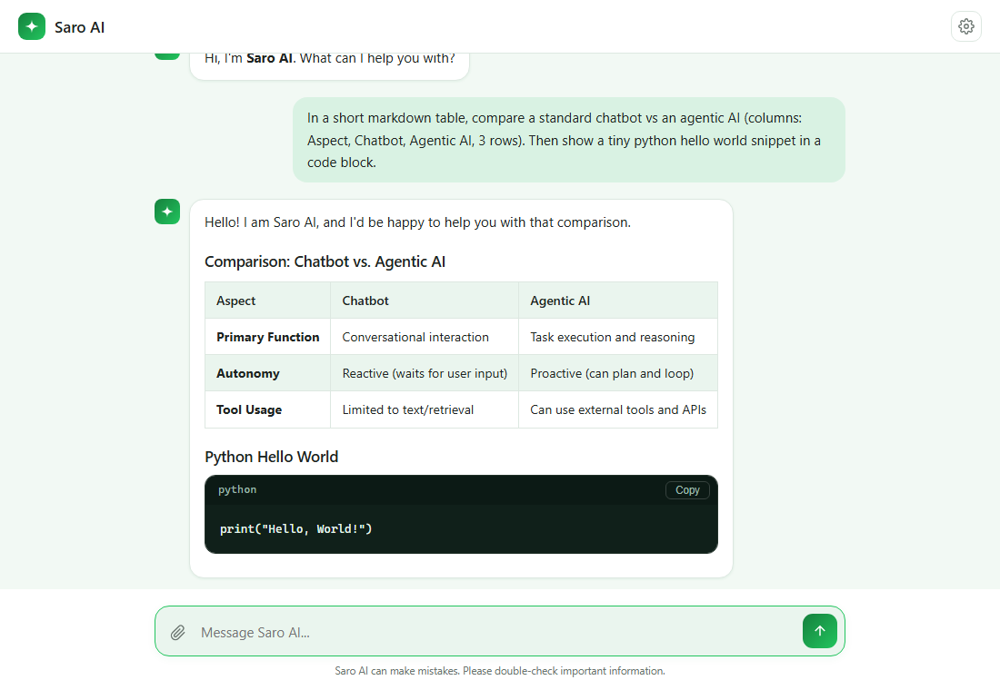
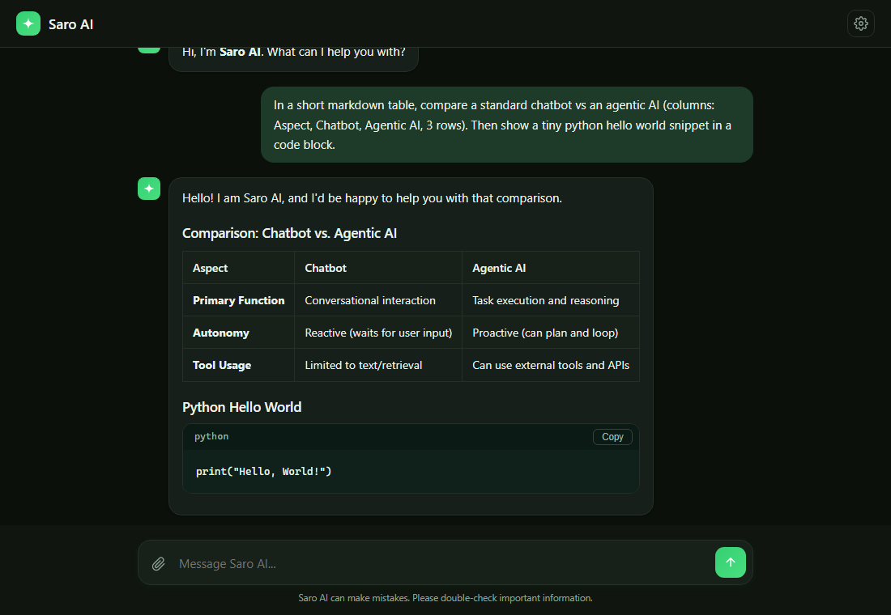

<div align="center">

# 🌿 Saro AI

**A private, self-hosted AI chatbot that just works — offline-first, cloud-optional.**

Runs a small local model via [Ollama](https://ollama.com) when it can, and transparently
falls back to a cloud model when it can't. No setup required for end users — open it and chat.

**Live demo:** [saro-ai.vercel.app](https://saro-ai.vercel.app)



</div>

## Features

- 🔌 **Zero-config by default** — a built-in cloud key means it works out of the box; no
  API key or local install required to start chatting.
- 💻 **Offline-capable** — install [Ollama](https://ollama.com) and pull a small model
  (e.g. `phi3:mini`) and Saro AI automatically prefers it over the cloud, so it keeps
  working with no internet connection.
- 🔁 **Automatic fallback, invisible to the user** — the backend checks whether the local
  model is available; if not, it transparently uses the cloud instead. There's no mode
  toggle to configure.
- 🎨 **Clean, Claude-style chat UI** — light and dark themes, proper markdown rendering
  (tables, code blocks, lists), and a copy button on every code block.
- 📎 **Image & file attachments** — attach photos (with camera capture on mobile) or
  text-based files (`.txt`, `.md`, `.csv`, `.json`, …) directly in the chat.
- 🔑 **Bring your own key** — optionally connect your own OpenAI, Claude (Anthropic),
  DeepSeek, or any other OpenAI-compatible provider from Settings.
- 🏷️ **Custom assistant name** — rename your assistant and it responds to its new name.
- 📱 **Fully responsive** — works cleanly on desktop and mobile.

<div align="center">

</div>

## How it works

```
                     ┌──────────────────────────┐
  Your message  ───▶ │   FastAPI backend         │
                     │                           │
                     │  1. Ollama running?       │──yes──▶ Local model (offline)
                     │        │no                │
                     │        ▼                  │
                     │  2. Built-in cloud key     │──────▶ OpenRouter (free-tier
                     │     (or your own, if set)  │         fallback chain)
                     └──────────────────────────┘
```

The frontend never knows or cares which backend answered — it just gets a streamed
response.

## Getting started

1. **Install dependencies**

   ```bash
   pip install -r requirements.txt
   ```

2. **Run the app**

   ```bash
   python app.py
   ```

   Open **http://127.0.0.1:8000** — it works immediately with the built-in cloud key.

That's it. Everything below is optional.

## Deploying to Vercel

This repo is pre-configured for Vercel (`vercel.json` + `api/index.py` expose the FastAPI
app as a Python serverless function).

```bash
npm i -g vercel
vercel link          # create/link a project
vercel env add OPENROUTER_API_KEY production
vercel env add OPENROUTER_MODEL production
vercel --prod
```

**Important:** Vercel is a cloud platform — there is no "local machine" for a deployed
function to reach, so **Local (Ollama) mode never activates there**. The health check
simply fails fast and every request automatically uses the cloud provider instead; this
is expected, not a bug. Local/offline mode is only meaningful when you run `python app.py`
yourself, on your own machine.

## Optional: run fully offline (local model)

1. Install [Ollama](https://ollama.com/download).
2. Pull a small model that runs well on modest hardware:

   ```bash
   ollama pull phi3:mini
   ```

   Other good low-spec options: `gemma2:2b`, `qwen2.5:1.5b`, `llama3.2:1b`.
3. Make sure Ollama is running (it usually starts automatically after install). Saro AI
   will now use it automatically whenever it's available.

## Optional: use your own API key

Saro AI already works out of the box, but you can bring your own key for a specific
provider from **Settings (⚙) → API providers**:

| Provider | What you need |
|---|---|
| OpenAI | An API key from [platform.openai.com](https://platform.openai.com) |
| Claude (Anthropic) | An API key from [console.anthropic.com](https://console.anthropic.com) |
| DeepSeek | An API key from [platform.deepseek.com](https://platform.deepseek.com) |
| Custom | Any OpenAI-compatible `/chat/completions` endpoint, key, and model name |

Turning a provider's toggle on routes every message through that provider using your
key instead of the built-in default. Only one provider can be active at a time.

## Configuration (`.env`)

Copy `.env.example` to `.env` if you want to set the built-in cloud key yourself, or
change the default local model:

```bash
OPENROUTER_API_KEY=      # built-in cloud fallback — get one at openrouter.ai/keys
OPENROUTER_MODEL=google/gemma-4-26b-a4b-it:free

OLLAMA_HOST=http://localhost:11434
OLLAMA_MODEL=phi3:mini
```

`.env` is gitignored — never commit real keys.

## Project structure

```
app.py              FastAPI backend: routing, providers, streaming
static/
  index.html         Chat UI markup
  style.css           Light/dark themes, responsive layout
  script.js            Chat logic, markdown rendering, settings, attachments
requirements.txt     Python dependencies
.env.example        Template for local configuration
```

## Privacy

- Any API key you add in Settings is stored only in your browser's `localStorage` and
  sent directly to this app's own local server — never anywhere else.
- Local mode (Ollama) never sends anything outside your machine.
- Saro AI can make mistakes — double-check anything important.

## License

For personal use.
